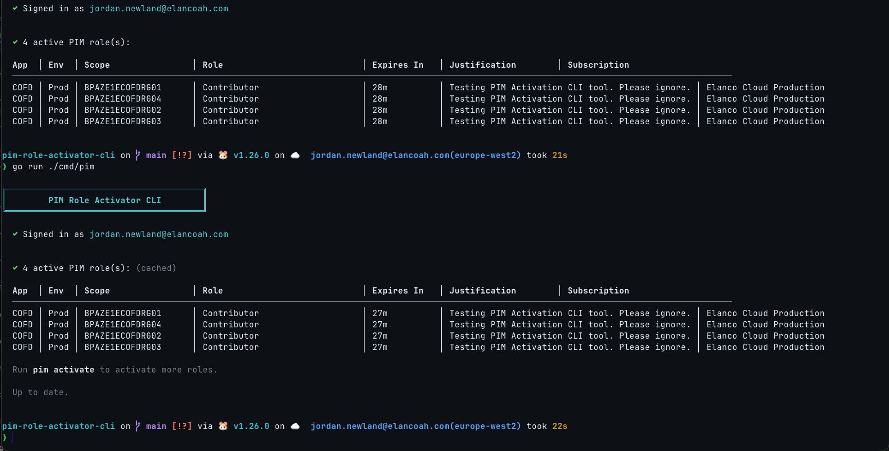

# Active Roles Cache

## Overview

The `pim` status command (the default when you run `pim` with no subcommand) checks for currently active PIM role assignments by querying the Azure ARM API. This can be slow — typically 1–5 seconds per subscription — because the `RoleAssignmentScheduleInstances.ListForScope` endpoint has inherent latency.

To improve perceived performance, the CLI caches active role results to disk after each successful API fetch. On subsequent runs, cached results are displayed **instantly** while a background refresh fetches the latest data from the API.

## How it works

1. **First run (no cache):** The CLI shows a spinner ("Checking active PIM roles…"), fetches from the API, prints the table, and saves the results to `~/.pim/active-roles-data.json`.

2. **Subsequent runs (cache hit):** The CLI immediately prints the cached table with a "(cached)" label, then shows a "Refreshing active roles…" spinner while fetching fresh data. Once the refresh completes:
   - If the data is unchanged: prints "Up to date."
   - If the data has changed: prints the updated table.

3. **Cache expiry:** The cache TTL is set to the **minimum remaining expiry** of all active roles (capped at `cache_ttl_hours` from config, default 24h). This means the cache automatically invalidates when the soonest-expiring role lapses.

4. **Graceful degradation:** If the API refresh fails after cached results have been shown, a warning is printed but the command still succeeds — the user at least sees the cached state.

## Demo

First run without cache (21s), then second run with cache showing instant results:

## Known limitations & future work

### Activation propagation delay

After activating roles (via `pim activate` or the Azure Portal), there is a short delay before the ARM API reflects the new assignment. This means running `pim` immediately after activation may not show the newly activated roles. This is an API-side limitation, not a CLI bug. Typically the delay is a few seconds, but it can occasionally take up to a minute.

### Table layout on small screens

The current table layout includes columns for App, Env, Scope, Role, Expires In, Justification, and Subscription. With long justification text this can exceed the terminal width, especially on smaller screens (e.g. laptops at 1080p or split-pane terminals). Future improvements could include:

- **Compact/card layout** — render each role as a multi-line card instead of a single table row.
- **Truncate or omit justification** — only show justification on demand (e.g. `pim --verbose`).
- **Responsive column selection** — detect terminal width and hide lower-priority columns automatically.
- **Wrap long values** — allow cell content to wrap within a fixed column width.

## Cache files

| File                            | Purpose                                                              |
| ------------------------------- | -------------------------------------------------------------------- |
| `~/.pim/active-roles-data.json` | Serialised `[]CachedActiveRole` with absolute `ExpiresAt` timestamps |
| `~/.pim/active-roles-meta.json` | Sidecar recording `written_at` for TTL expiry checks                 |
