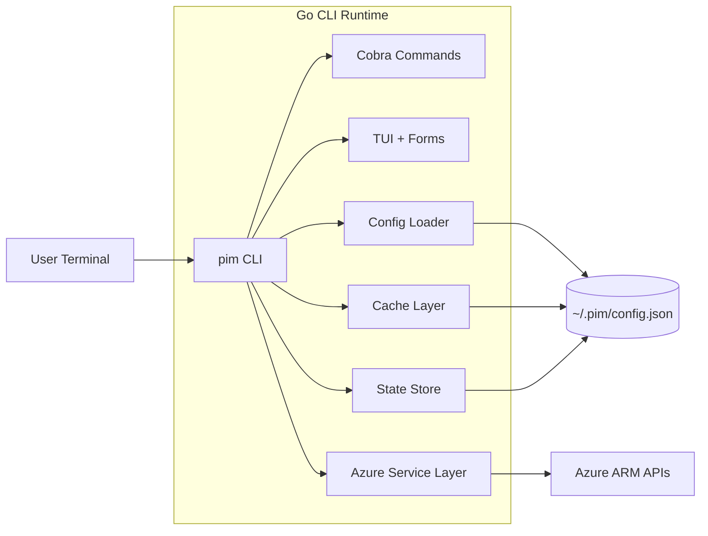
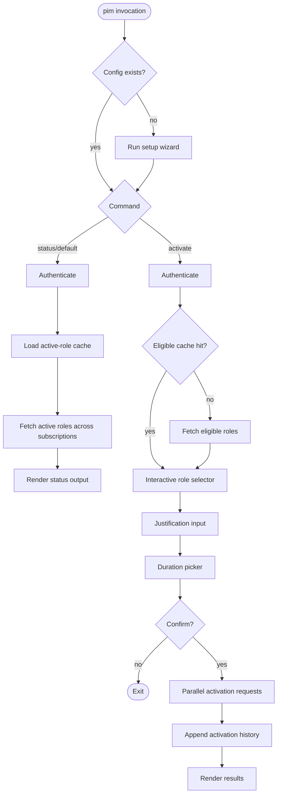

# Architecture

## Overview

PIM Role Activator CLI is a Go command-line application that provides two main execution paths:

- `pim` / `pim status` for active-assignment visibility
- `pim activate` for interactive eligible-role activation

The runtime combines:

- Azure SDK clients for ARM control-plane calls
- Terminal-first UX components (Bubble Tea, Huh, Lip Gloss)
- Local config/cache/state files under `~/.pim/`

## Core Dependencies

| Dependency                                                                                | Purpose                                     |
| ----------------------------------------------------------------------------------------- | ------------------------------------------- |
| `github.com/Azure/azure-sdk-for-go/sdk/azidentity`                                        | Authentication via `DefaultAzureCredential` |
| `github.com/Azure/azure-sdk-for-go/sdk/resourcemanager/authorization/armauthorization/v2` | PIM/authorization ARM APIs                  |
| `github.com/spf13/cobra`                                                                  | Command/flag routing                        |
| `github.com/charmbracelet/bubbletea`                                                      | Interactive role selector + duration picker |
| `github.com/charmbracelet/huh`                                                            | Setup and input forms                       |
| `github.com/charmbracelet/lipgloss`                                                       | Terminal styling                            |
| `github.com/google/uuid`                                                                  | Activation request IDs                      |

## Key Technologies and Prerequisites

- Go 1.25+
- Azure CLI installed and logged in (`az login`)
- Access to Azure subscriptions with eligible PIM assignments
- Platform support: macOS, Linux, Windows

## External Services Integrated

- Azure Resource Manager (`management.azure.com`) endpoints for:
  - `RoleEligibilityScheduleInstances`
  - `RoleAssignmentScheduleInstances`
  - `RoleAssignmentScheduleRequests`
- GitHub Actions for linting, tests, builds, docs checks, releases

## Project Structure

```text
pim-role-activator-cli/
├── cmd/pim/main.go
├── internal/
│   ├── azure/      # ARM client setup, eligible/active fetch, activation
│   ├── cache/      # eligible + active role cache implementations
│   ├── config/     # persisted user configuration and validation
│   ├── model/      # shared data types
│   ├── setup/      # interactive first-run/setup wizard
│   ├── state/      # activation history persistence
│   └── tui/        # selector, duration picker, status/results rendering
├── docs/
└── .github/workflows/
```

## Runtime Component Diagram



## Command Flow



## Status Mode (`pim` / `pim status`)

1. Build context with timeout from `--timeout`
2. Authenticate with `DefaultAzureCredential`
3. Optionally show cached active roles immediately
4. Fetch active assignments across configured subscriptions concurrently
5. Join API data with local justification history (`activations.json`)
6. Persist refreshed active-role cache with dynamic TTL
7. Render table (or empty-state) output

## Activate Mode (`pim activate`)

1. Build context with timeout from `--timeout`
2. Authenticate with `DefaultAzureCredential`
3. Load eligible-role cache (unless `--no-cache`) or fetch from ARM
4. Run role selector TUI
5. Collect justification and duration
6. Print summary; prompt `Proceed with activation? (y/N)`
7. Submit `SelfActivate` requests using bounded worker concurrency
8. Append successful activations to local state
9. Render activation results

## Data Ownership

- `config.json`: user configuration and preferences
- `eligible-roles-*.json`: cached eligible-role dataset and metadata
- `active-roles-*.json`: cached active-role dataset and metadata
- `activations.json`: local successful activation history for justification lookup

## Design Notes

- Uses context cancellation for Ctrl+C / SIGTERM handling
- Separates domain models from transport/client code
- Uses structured logging for warnings/errors and optional timing diagnostics
- Keeps terminal output concise while preserving subscription visibility
